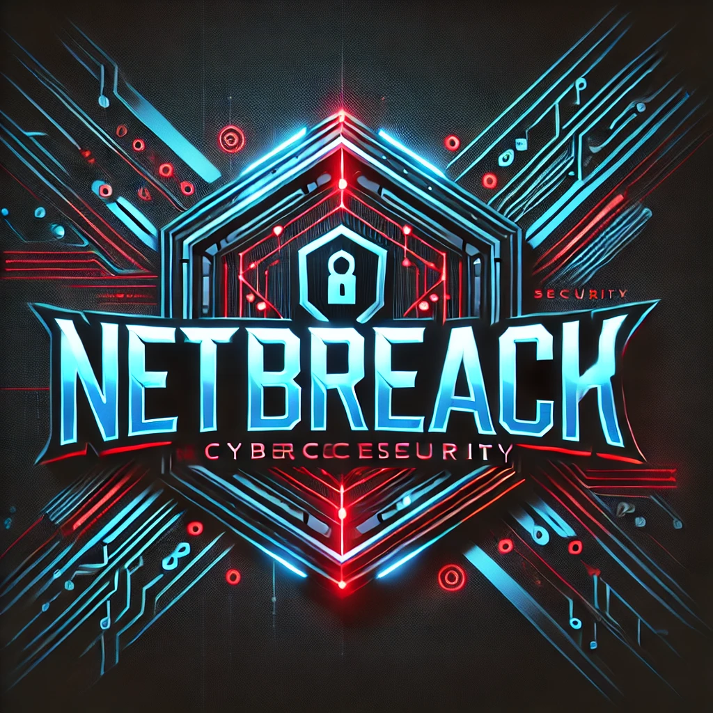

# NetBreach
# CREATION DATA: NOV/1/2022


# !Do not use this software in Schools or Business! 

# First type 
```git
git clone https://github.com/WilSegale/NetBreachX.git
```

# Second step is to type
```bash
sudo python3 setup.py
```

## This file will explain how the program works and how to use it to it's full capacity
- [Linux README.md](linux/README.md)
- [Mac README.md](MacOs/README.md)
 
# Troubleshooting SSH: Remote Host Identification Changed

If you encounter the following error message when connecting to an SSH server:

```plaintext
@@@@@@@@@@@@@@@@@@@@@@@@@@@@@@@@@@@@@@@@@@@@@@@@@@@@@@@@@@@
@    WARNING: REMOTE HOST IDENTIFICATION HAS CHANGED!     @
@@@@@@@@@@@@@@@@@@@@@@@@@@@@@@@@@@@@@@@@@@@@@@@@@@@@@@@@@@@
```
# you can go to this file and delate all the hashes that are connected to previously used for ssh hosts
```ssh hash config```
```plaintext
cd ~/.ssh

open known_hosts
```

# You can type the following command in the CLI
```plaintext
ssh [username]@[hostname]
```

# if the user you are attacking has changed their port number for ssh type this command instead of the one on top

```plaintext
ssh [username]@[hostname] -p [port Number]
```
